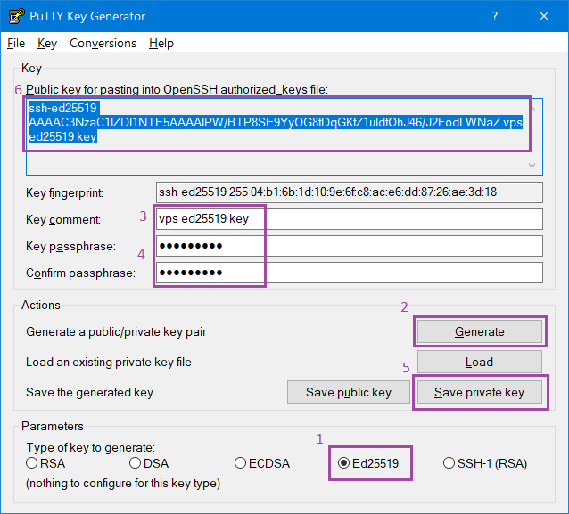
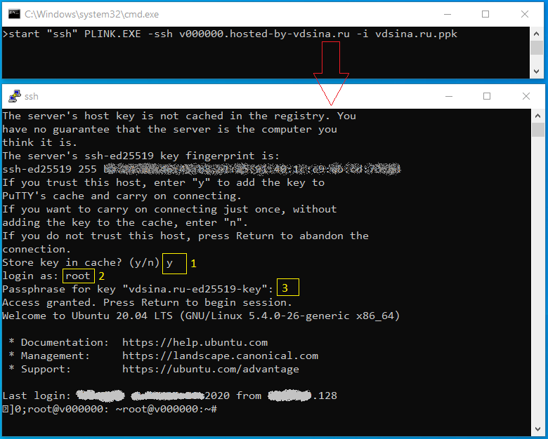

# [ <kbd>↑</kbd> ](#up) <a name="up">[Первоначальная настройка сервера на Ubuntu 20.04](#up)</a>

Проверено на [этом vps-хостинге](https://vdsina.ru/?partner=yfr2sd6574).

Изначально, сразу после запуска новый сервер на Ubuntu 20.04 будет доступен пользователю `root` через `ssh` по паролю. Это не безопасно по следующим причинам:

* `root` является администратором и имеет самые широкие права в системе - можно случайно что-нибудь поломать, для повседневной работы лучше использовать ограниченную учётную запись, включая, при необходимости, повышенный доступ

* использование паролей для входа через ssh означает вероятность успешной атаки подбора пароля, а значит и взлома вашего сервера - ssh-ключи в этом плане намного безопаснее

В этом руководстве мы по-шагово настроим новый vps-сервер:

* [сгенерируем пару (открытый / закрытый) ключей по алгоритму `Ed25519` и запустим новый сервер с `root`-доступом по открытому ключу](#step1)

* [добавим нового пользователя `adam` и сделаем его `sudo`-пользователем](#step2)

* [включим брандмауэр `ufw` и разрешим работу `OpenSSH`](#step3)

* также настроим `adam`'у ssh-доступ через тот же ключ

* запретим вход по паролю для всех

* запретим вход для `root`, в том числе с авторизацией по ключу

## [ <kbd>↑</kbd> ](#up) <a name="step1">[Шаг 1 - Подготовка SSH-ключей, установка виртуального сервера](#step1)</a>

### Подготовка ключей в ОС Windows

Воспользуемся программой [`PuTTY Key Generator 32bit Release 0.73`](https://puttygen.com/download.php?val=46)

1. выбираем алгоритм `Ed25519`

2. нажимаем `Generate`

3. указываем описание (рекомендуется)

4. защищаем закрытый ключ парольной фразой (рекомендуется)

5. сохраняем закрытый ключ в файл `vdsina.ru.ppk`

6. выделяем и копируем в буфер обмена текст открытого ключа

7. добавляем текст открытого ключа через панель хостинга на вкладке [`SSH-ключи`](https://cp.vdsina.ru/sshkey/list)

### Подготовка виртуального сервера

Добавляем новый / переустанавливаем существующий сервер через хостинг-панель. Для доступа **обязательно** указываем ssh-ключ, добавленный в п.7.

Воспользуемся консольной программой [`plink.exe`](https://the.earth.li/~sgtatham/putty/latest/w32/plink.exe) для подключения к нашему серверу с использованием файла закрытого ssh-ключа

    start "ssh" PLINK.EXE -ssh v000000.hosted-by-vdsina.ru -i vdsina.ru.ppk

где `v000000.hosted-by-vdsina.ru` - имя нашего виртуального сервера

1. сохраним в кэш открытый ключ нашего сервера

2. входим под `root`

3. указываем парольную фразу, которую мы установили на закрытую часть ключа в п.4

Поздравляем! `root@v000000:~#` - приглашение bash, оболочки по умолчанию в Ubuntu 20.04 - означает успешный вход на сервер. Теперь можно приступать к его настройке.

P.S. Вместо консольной `plink.exe` для ssh-подключений можно, например, воспользоваться GUI-утилитой [`KiTTY`](http://www.9bis.net/kitty/files/kitty_nocompress.exe), которая не требует установки и имеет множество различных настроек.

## [ <kbd>↑</kbd> ](#up) <a name="step2">[Шаг 2 - Добавляем нового пользователя](#step2)</a>

Пока мы вошли в систему под `root` - суперпользователем - но, в дальнейшем, всю работу на сервере будем выполнять из-под ограниченной учётной записи `adam`, в том числе и требующую прав администратора ОС.

Для этого выполним команду:

    adduser adam

В процессе нужно будет установить пароль и ответить ещё на несколько вопросов.

Далее внесём его в группу `sudo`, что позволит запускать команды с повышенными привелегиями:

    usermod -aG sudo adam

Проверим работу новой учётной записи, подменив `root`'-а на `adam`'-а:

    su - adam
    whoami                          # must be adam
    sudo whoami                     # test sudo access, output must be root

В случае ошибки, можно удалить пользователя вместе с его домашним каталогом и начать заново:

    sudo deluser --remove-home adam

## [ <kbd>↑</kbd> ](#up)<a name="step3">[Шаг 3 - Включаем брандмауэр](#step3)</a>

Проверим регистрацию приложения `OpenSSH`:

    ufw app list

Разрешим приложению работу через брандмауэр:

    ufw allow OpenSSH

включим брандмауэр:

    ufw enable

и проверим текущее состояние:

    ufw status

## [ <kbd>↑</kbd> ](#up)<a name="step4">[Шаг 4 - включаем ssh-доступ для нового пользователя](#step4)</a>

Когда мы запустили сервер, определив ssh-ключ для доступа, он был сохранён в домашней папке `root`'-а в файле `~/.ssh/authorized_keys`, посмотреть который можно

    cat ~/.ssh/authorized_keys

Самый простой способ организовать ssh-доступ для `adam`'-а - скопировать, сохранив права доступа, структуру `/root/.ssh` в его домашний каталог, используюя `rsync`:

    rsync --archive --chown=adam:adam /root/.ssh /home/adam

 **Примечание:** команда `rsync` по-разному обрабатывает источники и приемники с завершающим слэшем и без завершающего слэша. При использовании команды убедитесь, что исходный каталог `/root/.ssh` не содержит завершающий слэш (убедитесь, что вы не используете `/root/.ssh/`).

Если вы случайно добавили завершающий слэш в команду, `rsync` скопирует *содержимое* каталога `/root/.ssh/` вместо *его структуры* в домашний каталог пользователя. Файлы будут храниться в неправильном месте, и `OpenSSH` не сможет их найти и использовать.

Проверьте вход на сервер под учётной записью `adam`. Если все ok - можно двигаться дальше и отключить вход по паролям и вход для `root`.

P.S. Вместо использования готовых файлов `root`'-а можно пойти другим путём - сгенерировать новую пару ключей:

    su - adam
    ssh-keygen -o -a 100 -t ed25519
    ssh-copy-id adam@v000000.hosted-by-vdsina.ru
    chmod 600 ~/.ssh/authorized_keys

Сохраните закрытый ключ на свой ПК - например, используя [WinSCP](https://winscp.net/download/WinSCP-5.17.5-Portable.zip) или выведя его на экран:

    cat ~/.ssh/id_ed25519

а затем удалите закрытый ключ с сервера:

    rm -f ~/.ssh/id_ed25519

Сервер использует только публичную часть ключевой пары, а закрытую - ssh-клиент, с помощью которого вы к нему подключаетесь.

## [ <kbd>↑</kbd> ](#up)a name="step5">[Шаг 5 - Настройка службы `sshd`](#step5)</a>

Дальнейшие настройки выполним, войдя на сервер под пользователем `adam`, которого мы добавили на 2-ом шаге. Сначала, на всякий случай, сделаем резервную копию оригинального файла конфига:

    sudo cp /etc/ssh/sshd_config /etc/ssh/sshd_config.backup

и уберём у неё доступ на запись:

    sudo chmod a-w /etc/ssh/sshd_config.backup

Отредактируем текущий конфиг:

    sudo nano /etc/ssh/sshd_config

(используйте комбинацию `alt + shift + 3`, чтобы включить в редакторе `nano` отображение номеров строк)

    PermitRootLogin no
    PubkeyAuthentication yes
    PasswordAuthentication no
    PermitEmptyPasswords no

Перезапустим службу `sshd`:

    sudo systemctl restart sshd.service

Поздравляем! Вы подготовили хорошую основу для вашего нового сервера. Теперь он готов для дальнейшей установки необходимых сервисов и приложений!

## [ <kbd>↑</kbd> ](#up)<a name="step6">[P.S. не забывайте регулярно обновлять ваш сервер](#step6)</a>

    sudo apt update && sudo apt upgrade -y
