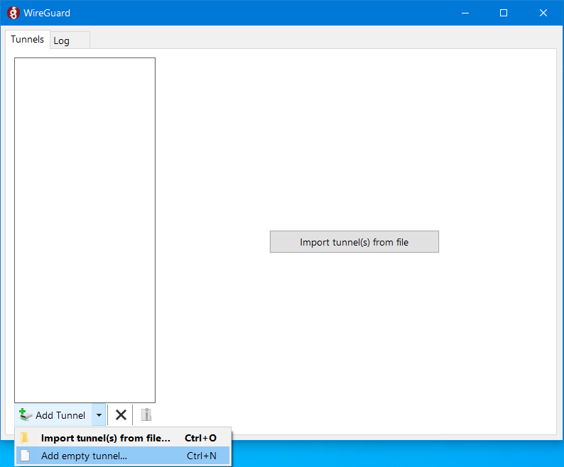
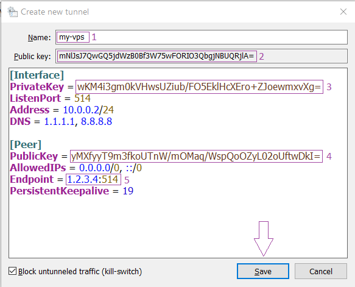
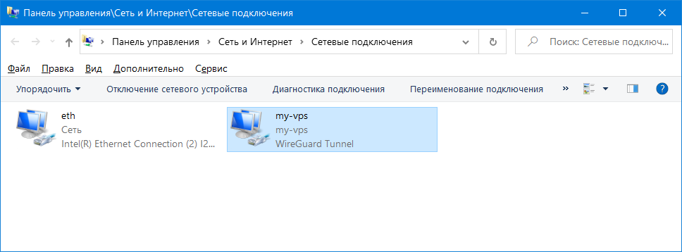
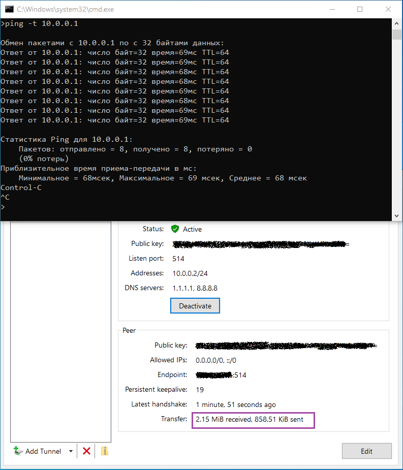

# [ <kbd>←</kbd> PlayGrounds ReadMe](https://github.com/mitmih/PlayGrounds/blob/master/readme.md) <a name="up">[](#up)</a>

# [ <kbd>↑</kbd> ](#up) <a name="h1">[Запуск vpn-сервиса WireGuard на базе Ubuntu 20.04](#h1 '"Туннельный синдром"')</a>

VPN - Virtual Private Network - Виртуальная Частная Сеть - множество технологий, с помощью которых вы можете поверх публичной сети, как правило -Интернет, построить свою *логическую (виртуальную)* сеть.

Наверное, вы уже столкнулись с одной из таких технологий, когда провайдер предоставил вам доступ в Интернет: обычно абонентов подключают по технологии PPPoE или L2TP.

Работа в vpn-сети, конечно, в зависимости от качества каналов связи, не будет для вас заметно отличаться от работы в домашней или офисной *физической* - Wi-Fi / Ethernet - сети.

Технологии VPN применяются и крупными компаниями и простыми пользователями с очень разными целями. Например:

* корпорации таким образом связывают между собой локальные сети своих филиалов

* это хороший способ безопасно подкючить к корпоративной сети удалённых сотрудников в условиях, например, гостиничного Wi-Fi

* обычные пользователи могут с помощью VPN [сэкономить при покупках](https://habr.com/ru/company/hidemy_name/blog/404017/)

* или покупать товары в тех зарубежных магазинах, которые не продают, если заходить на их сайты напрямую

Последняя пара пунктов работает следующим образом: когда пользователь использует зарубежный VPN-сервер для выхода в Сеть, то сайты видят IP VPN-сервера, а не настоящий, выданный провайдером адрес.

Самые простые способы - бесплатные VPN-сервисы - часто оказываются и самыми ненадёжными в плане конфеденциальности, [зарабатывая на ваших личных данных.](https://habr.com/ru/company/hidemy_name/blog/450416/)

Более сложный, и в тоже время надёжный способ - организовать собственный WireGuard / Outline / OpenVPN / etc сервис, который вы будете полностью контролировать.

[WireGuard](https://www.wireguard.com/performance/#results) - новый и успешно развивающийся проект, производительный и простой в настройке. Рецепт приготовления vpn-сервиса на его основе состоит из следующих этапов:

* [ставим WireGuard, готовим ключи](#step1)

* [готовим виртуальный сетевой интерфейс, нарезаем клиентские настройки ломтиками](#step2)

* [разогреваем Windows-клиента](#step3)

* [пробуем туннель "на вкус"](#step4)

* ["Всегда готов!" - автозапуск WireGuard](#step5)

* ["Скороварка" - готовим туннель быстрее](#step6)

* [Linux-клиент - за стол!](#step7)

* [QR-код на закуску](#step8)


## [ <kbd>↑</kbd> ](#up) <a name="step1">[Шаг 1 - Устанавливаем WireGuard, разбираемся с серверными ключами шифрования](#step1)</a>

Основой для WireGuard-сервиса будет приготовленный по [этому рецепту](https://github.com/mitmih/PlayGrounds/blob/master/VPS/01_ubuntu_20.04_server_-_first_steps.md) сервер.

WireGuard можно [собрать из исходников](https://www.wireguard.com/compilation/) или установить готовый пакет из репозитория через пакетный менеджер:

```console
adam@my-vps:~$ sudo apt install wireguard -y
Reading package lists... Done
Building dependency tree
Reading state information... Done
The following additional packages will be installed:
  wireguard-tools
The following NEW packages will be installed:
  wireguard wireguard-tools
0 upgraded, 2 newly installed, 0 to remove and 0 not upgraded.
Need to get 85.3 kB of archives.
After this operation, 341 kB of additional disk space will be used.
Get:1 http://mirror.nl.leaseweb.net/ubuntu focal/universe amd64 wireguard-tools amd64 1.0.20200319-1ubuntu1 [82.4 kB]
Get:2 http://mirror.nl.leaseweb.net/ubuntu focal/universe amd64 wireguard all 1.0.20200319-1ubuntu1 [2,912 B]
Fetched 85.3 kB in 0s (1,124 kB/s)
Selecting previously unselected package wireguard-tools.
(Reading database ... 101648 files and directories currently installed.)
Preparing to unpack .../wireguard-tools_1.0.20200319-1ubuntu1_amd64.deb ...
Unpacking wireguard-tools (1.0.20200319-1ubuntu1) ...
Selecting previously unselected package wireguard.
Preparing to unpack .../wireguard_1.0.20200319-1ubuntu1_all.deb ...
Unpacking wireguard (1.0.20200319-1ubuntu1) ...
Setting up wireguard-tools (1.0.20200319-1ubuntu1) ...
Setting up wireguard (1.0.20200319-1ubuntu1) ...
Processing triggers for man-db (2.9.1-1) ...
```

Далее генерируем пару - закрытый / открытый - ключей для нашего сервера:

```console
adam@my-vps:~$ (umask 077 && printf "[Interface]\nPrivateKey = " | sudo tee /etc/wireguard/wg0.conf > /dev/null)
adam@my-vps:~$ wg genkey | sudo tee -a /etc/wireguard/wg0.conf | wg pubkey | sudo tee /etc/wireguard/publickey
yMXfyyT9m3fkoUTnW/mOMaq/WspQoOZyL02oUftwDkI=
```

Здесь

* `/etc/wireguard/wg0.conf` - конфиг виртуального сетевого интерфейса, который будет шифровать и обрабатывать трафик между сервером и клиентами, также здесь записан закрытый, т.е. *секретный* ключ сервера в формате `base64`

    ```console
    adam@my-vps:~$ sudo cat /etc/wireguard/wg0.conf
    [Interface]
    PrivateKey = cCCJ27hpJvdIVmCAvVk8FRAt9caNR3zpH5eeUoL3uHg=
    ```

* `/etc/wireguard/publickey` - публичный ключ сервера, который прописывается на клиентах

    ```console
    adam@my-vps:~$ sudo cat /etc/wireguard/publickey
    yMXfyyT9m3fkoUTnW/mOMaq/WspQoOZyL02oUftwDkI=
    ```

Естесственно, ваша пара ключей будет другой, поэтому дальше в примерах конфигов сервера или клиентов вместо действительных ключей будут указаны псевдонимы:

* `SERVER_PUBLIC_KEY` - открытый ключ сервера

* `SERVER_PRIVATE_KEY` - закрытый, **секретный** ключ сервера

* `CLIENT_PUBLIC_KEY` - открытый ключ клиента

* `CLIENT_PRIVATE_KEY` - закрытый, **секретный** ключ клиента

> Зачем нужны ключи и почему их всегда пара?
> 
> Сначала генерируется закрытый ключ, затем к нему подбирается открытая часть так, что теперь они соответствуют друг другу и начинают работать вместе:
> 
> * Отправитель **подписывает** своё сообщение **своим закрытым ключом**, затем **шифрует открытым ключом получателя**.
> 
> * Получатель **расшифровывает** сообщение **своим закрытым ключём** и **проверяет подпись** сообщения **открытым ключом отправителя**.
> 
> Вот, почему вы должны хранить свой **закрытый ключ в тайне**: он позволяет **расшифровывать входящие** и **подписывать исходящие** сообщения.
> 
> И вот, почему ваш **открытый ключ должны знать** ваши партнёры по коммуникации: им **шифруют отправляемые** вам и **проверяют принятые** от вас сообщения.
> 
> Есть замечательные примеры с почтовой посылкой и замками, которые на неё по очереди навешивают и снимают Алиса с Бобом :)
> 
> * ["Асимметричное шифрование. Как это работает?"](https://intsystem.org/security/asymmetric-encryption-how-it-work/)
> 
> * ["Открытый и закрытый ключ шифрования"](https://firstssl.ru/faq/general-questions/kluch-shifrovania)


## [ <kbd>↑</kbd> ](#up) <a name="step2">[Шаг 2 - конфигурация виртуального сетевого интерфейса wg-сервера](#step2)</a>

Откроем конфиг виртуального сетевого интерфейса - `wg0` - в редакторе:

```console
adam@my-vps:~$ sudo nano /etc/wireguard/wg0.conf
```

и добавим необходимые настройки

```properties
[Interface]
PrivateKey = SERVER_PRIVATE_KEY
Address = 10.0.0.1/24
ListenPort = 514
SaveConfig = true

PostUp = iptables -A FORWARD -i %i -j ACCEPT; iptables -t nat -A POSTROUTING -o ens3 -j MASQUERADE
PostDown = iptables -D FORWARD -i %i -j ACCEPT; iptables -t nat -D POSTROUTING -o ens3 -j MASQUERADE

[Peer]
AllowedIPs = 10.0.0.2/32
# PublicKey = CLIENT_PUBLIC_KEY
```

Где

* `[Interface]` - секция настроек `wg0`-интерфейса

* `Address = 10.0.0.1/24` - IP-адрес сервера в нашей vpn-сети, можно указать несколько адресов через запятую или в новых строчках

* `ListenPort = 514` - UDP-порт, по которому интерфейс сервера со своей стороны устанавливает соединения с клиентами

* `SaveConfig = true` - перезаписывать файл конфигурации при выключении `wg0`

    Этот параметр позволяет серверу подстраиваться под клиентов. Например, при первом подключении клиента сервер сам определит параметр `Endpoint = ip:port`, добавив в конфиг внешний IP-адрес клиента.

* `PostUp = ...` и `PostDown = ...` - команды, которые выполняются при включении и выключении интерфейса `wg0`

* `ens3` - сетевой интерфейс, который по умолчанию использует сервер для выхода в Интернет, можно узнать командой:

    ```console
    adam@my-vps:~$ ip -o -4 route show to default | awk '{print $5}'
    ```

* `[Peer]` - клиентские настройки, у каждого клиента своя отдельная секция `[Peer]`

* `AllowedIPs = 10.0.0.2/32` - IP-адрес клиента в vpn-сети

* `# PublicKey = CLIENT_PUBLIC_KEY` - запишем сюда открытый ключ клиента, когда настроим на нём WireGuard и получим пару ключей, а пока оставим эту строку закомментированной

Наша цель - пропускать через WireGuard весь трафик, *от* и *к* клиенту. Поэтому нужно, чтобы работал NAT.

Отредактируем файл `/etc/sysctl.conf`, разрешив перенаправление IP трафика:

```console
adam@my-vps:~$ sudo nano /etc/sysctl.conf
```

```properties
net.ipv4.ip_forward=1
net.ipv6.conf.all.forwarding=1
```

Проверим изменения:

```console
adam@my-vps:~$ sudo sysctl -p
net.ipv4.ip_forward = 1
net.ipv6.conf.all.forwarding = 1
```

<!--     
    # https://forum.keenetic.net/topic/7868-перенаправление-траффика-в-wg0/
    # net.ipv4.tcp_fwmark_accept=1
    # net.ipv6.conf.default.forwarding=1
    # net.ipv6.conf.all.forwarding=1
 -->

У нас включен брандмауэр `ufw` - разрешим UDP-трафик на 514 порту:

```console
adam@my-vps:~$ sudo ufw allow 514/udp
Rule added
Rule added (v6)
```


## [ <kbd>↑</kbd> ](#up) <a name="step3">[Шаг 3 - Настройка клиента в ОС Windows](#step3)</a>

Скачиваем клиент [с официального сайта](https://download.wireguard.com/windows-client/wireguard-amd64-0.1.0.msi) и устанавливаем.

Добавим новый туннель <kbd>ctrl</kbd> <kbd>N</kbd>:



Настроим его следующим образом:

```properties
[Interface]
PrivateKey = CLIENT_PRIVATE_KEY
ListenPort = 514
Address = 10.0.0.2/24
DNS = 1.1.1.1, 8.8.8.8

[Peer]
PublicKey = SERVER_PUBLIC_KEY
AllowedIPs = 0.0.0.0/0, ::/0
Endpoint = SERVER_PUBLIC_IP:514
PersistentKeepalive = 19
```

где

* `Name: ` (1) - название клиентского виртуальный сетевой интерфейс

* `Public Key :` (2) - открытый ключ клиента, скопируйте его в буфер обмена и пропишите в конфиге интерфейса `wg0` на сервере, секция `[Peer]`:

    ```console
    adam@my-vps:~$ sudo nano /etc/wireguard/wg0.conf
    ```

    ```properties
    [Peer]
    AllowedIPs = 10.0.0.2/32
    PublicKey = CLIENT_PUBLIC_KEY <- (2)
    ```

* `[Interface]` - секция настроек виртуального интерфейса

* `PrivateKey = ` (3) - закрытый, т.е. *секретный* ключ клиента

* `ListenPort = 514` - UDP-порт сетевого интерфейса клиента, по которому он со своей стороны устанавливает соединение с сервером, может отличаться от сервера

* `Address = 10.0.0.2/24` - IP-адрес клиента в нашей vpn-сети

* `DNS = 1.1.1.1, 8.8.8.8` - IP-адреса DNS-серверов

* `[Peer]` - секция настроек сервера, с которым строим туннель

* `PublicKey = ` (4) - указываем публичный ключ сервера, полученный на [первом шаге](#step1)
    
    ```console
    adam@my-vps:~$ sudo cat /etc/wireguard/publickey
    yMXfyyT9m3fkoUTnW/mOMaq/WspQoOZyL02oUftwDkI=
    ```

* `AllowedIPs = 0.0.0.0/0, ::/0` - весь трафик клиента пойдет через туннель

* `Endpoint = SERVER_PUBLIC_IP:514` (5) - "белый" IP адрес и UDP-порт для соединения с WireGuard-сервером, например `1.2.3.4:514`

* `PersistentKeepalive = 19` - интервал в секундах, для поддержания туннеля отправкой ping'-а



После сохранения и активации туннеля появится новый сетевой интерфейс, который исчезнет после выключения:



## [ <kbd>↑</kbd> ](#up) <a name="step4">[Шаг 4 - Пробный запуск туннеля](#step4)</a>

Итак, все приготовления выполнены, пробуем соединиться! Включаем интерфейс `wg0` на сервере:

```console
adam@my-vps:~$ sudo wg-quick up wg0
[#] ip link add wg0 type wireguard
[#] wg setconf wg0 /dev/fd/63
[#] ip -4 address add 10.0.0.1/24 dev wg0
[#] ip link set mtu 1420 up dev wg0
[#] iptables -A FORWARD -i wg0 -j ACCEPT; iptables -t nat -A POSTROUTING -o ens3 -j MASQUERADE
```

Проверим открытые порты:

```console
adam@my-vps:~$ sudo ss -nltup
Netid   State    Recv-Q   Send-Q     Local Address:Port     Peer Address:Port   Process
udp     UNCONN   0        0                0.0.0.0:514           0.0.0.0:*
udp     UNCONN   0        0          127.0.0.53%lo:53            0.0.0.0:*       users:(("systemd-resolve",pid=392,fd=12))
udp     UNCONN   0        0                   [::]:514              [::]:*
tcp     LISTEN   0        4096       127.0.0.53%lo:53            0.0.0.0:*       users:(("systemd-resolve",pid=392,fd=13))
tcp     LISTEN   0        128              0.0.0.0:22            0.0.0.0:*       users:(("sshd",pid=1237,fd=3))
tcp     LISTEN   0        128                 [::]:22               [::]:*       users:(("sshd",pid=1237,fd=4))
```

Активируем интерфейс клиента и проверим доступность VPN-IP сервера:

```cmd
>ping -t 10.0.0.1

Обмен пакетами с 10.0.0.1 по с 32 байтами данных:
Ответ от 10.0.0.1: число байт=32 время=69мс TTL=64
Ответ от 10.0.0.1: число байт=32 время=69мс TTL=64
Ответ от 10.0.0.1: число байт=32 время=69мс TTL=64
Ответ от 10.0.0.1: число байт=32 время=69мс TTL=64
Ответ от 10.0.0.1: число байт=32 время=68мс TTL=64
Ответ от 10.0.0.1: число байт=32 время=68мс TTL=64
Ответ от 10.0.0.1: число байт=32 время=69мс TTL=64
Ответ от 10.0.0.1: число байт=32 время=68мс TTL=64

Статистика Ping для 10.0.0.1:
    Пакетов: отправлено = 8, получено = 8, потеряно = 0
    (0% потерь)
Приблизительное время приема-передачи в мс:
    Минимальное = 68мсек, Максимальное = 69 мсек, Среднее = 68 мсек
Control-C
^C
```



Чтобы также проверить обратное направление - доступность клиента с сервера - в брандмауэре разрешите Windows отвечать на icmp-запросы: откройте `Панель управления\Система и безопасность\Брандмауэр Защитника Windows`, перейдите в `Дополнительные параметры\Правила для входящих подключений` и включите правило `Общий доступ к файлам и принтерам (эхо-запрос - входящий трафик ICMPv4)` для профиля `Общий`.

```console
adam@my-vps:~$ ping 10.0.0.2
PING 10.0.0.2 (10.0.0.2) 56(84) bytes of data.
64 bytes from 10.0.0.2: icmp_seq=1 ttl=128 time=68.7 ms
64 bytes from 10.0.0.2: icmp_seq=2 ttl=128 time=69.1 ms
64 bytes from 10.0.0.2: icmp_seq=3 ttl=128 time=69.0 ms
64 bytes from 10.0.0.2: icmp_seq=4 ttl=128 time=69.1 ms
^C
--- 10.0.0.2 ping statistics ---
4 packets transmitted, 4 received, 0% packet loss, time 3001ms
rtt min/avg/max/mdev = 68.743/68.984/69.120/0.143 ms
```

Убедимся, что наш трафик идёт через туннель, выполнив трассировку с клиента:

```cmd
TRACERT.EXE -w 500 google.com

Трассировка маршрута к google.com [216.58.211.110]
с максимальным числом прыжков 30:

  1    69 ms     *       68 ms  10.0.0.1
  2    70 ms    70 ms    70 ms  my-host.hosted-by-vdsina.ru [x.x.x.x]
  3    69 ms     *       69 ms  185.8.177.112
  4    70 ms    79 ms    70 ms  185.8.179.33
  5    71 ms     *       73 ms  74.125.119.118
  6    72 ms    73 ms    72 ms  108.170.241.161
  7    71 ms    71 ms     *     108.170.237.45
  8    71 ms    71 ms    71 ms  ams15s32-in-f14.1e100.net [216.58.211.110]

Трассировка завершена.
```

Также можно посмотреть текущую информацию во время работы WireGuard:

```console
adam@my-vps:~$ sudo wg
interface: wg0
  public key: <открытый ключ сервера>
  private key: (hidden)
  listening port: 514

peer: <открытый ключ клиента>
  endpoint: <внешний_IP_клиента>:514
  allowed ips: 10.0.0.2/32
  latest handshake: 7 seconds ago
  transfer: 149.31 KiB received, 195.32 KiB sent
```

Поздравляем, туннель приготовлен как следует и можно двигаться дальше, а пока - выключить туннель с обеих сторон:

```console
adam@my-vps:~$ sudo wg-quick down wg0
[#] wg showconf wg0
[#] ip link delete dev wg0
[#] iptables -D FORWARD -i wg0 -j ACCEPT; iptables -t nat -D POSTROUTING -o ens3 -j MASQUERADE
```

`wg0` выключен, UDP-порт 514 закрыт:


```console
adam@my-vps:~$ sudo ss -nltup
Netid   State    Recv-Q   Send-Q     Local Address:Port     Peer Address:Port   Process
udp     UNCONN   0        0          127.0.0.53%lo:53            0.0.0.0:*       users:(("systemd-resolve",pid=392,fd=12))
tcp     LISTEN   0        4096       127.0.0.53%lo:53            0.0.0.0:*       users:(("systemd-resolve",pid=392,fd=13))
tcp     LISTEN   0        128              0.0.0.0:22            0.0.0.0:*       users:(("sshd",pid=1237,fd=3))
tcp     LISTEN   0        128                 [::]:22               [::]:*       users:(("sshd",pid=1237,fd=4))

```

## [ <kbd>↑</kbd> ](#up) <a name="step5">[Шаг 5 - Включаем WireGuard в качестве системного сервиса](#step5)</a>

Ручное управление интерфейсом на сервере уже работает. Но что, если понадобился vpn, а вы забыли его включить после очередной перезагрузки сервера, да ещё и ssh-клиента нет под рукой?

Включаем автоматический запуск сервиса при старте операционной системы:

```console
adam@my-vps:~$ sudo systemctl enable wg-quick@wg0.service
Created symlink /etc/systemd/system/multi-user.target.wants/wg-quick@wg0.service → /lib/systemd/system/wg-quick@.service.
```

Запускаем сервис:

```console
adam@my-vps:~$ sudo systemctl start wg-quick@wg0.service
```

Проверяем статус работы сервиса:

```console
adam@my-vps:~$ sudo systemctl status wg-quick@wg0.service
● wg-quick@wg0.service - WireGuard via wg-quick(8) for wg0
     Loaded: loaded (/lib/systemd/system/wg-quick@.service; enabled; vendor preset: enabled)
     Active: active (exited) since Mon 2020-05-11 04:21:33 MSK; 6s ago
       Docs: man:wg-quick(8)
             man:wg(8)
             https://www.wireguard.com/
             https://www.wireguard.com/quickstart/
             https://git.zx2c4.com/wireguard-tools/about/src/man/wg-quick.8
             https://git.zx2c4.com/wireguard-tools/about/src/man/wg.8
    Process: 3784 ExecStart=/usr/bin/wg-quick up wg0 (code=exited, status=0/SUCCESS)
   Main PID: 3784 (code=exited, status=0/SUCCESS)

May 11 04:21:33 my-vps.hosted-by-vdsina.ru systemd[1]: Starting WireGuard via wg-quick(8) for wg0...
May 11 04:21:33 my-vps.hosted-by-vdsina.ru wg-quick[3784]: [#] ip link add wg0 type wireguard
May 11 04:21:33 my-vps.hosted-by-vdsina.ru wg-quick[3784]: [#] wg setconf wg0 /dev/fd/63
May 11 04:21:33 my-vps.hosted-by-vdsina.ru wg-quick[3784]: [#] ip -4 address add 10.0.0.1/24 dev wg0
May 11 04:21:33 my-vps.hosted-by-vdsina.ru wg-quick[3784]: [#] ip link set mtu 1420 up dev wg0
May 11 04:21:33 my-vps.hosted-by-vdsina.ru wg-quick[3784]: [#] iptables -A FORWARD -i wg0 -j ACCEPT; iptables -t nat -A POS>
May 11 04:21:33 my-vps.hosted-by-vdsina.ru systemd[1]: Finished WireGuard via wg-quick(8) for wg0.
```

Перезагружае сервер для проверки запуска сервиса:

```console
adam@my-vps:~$ sudo reboot
```

И, хотя vps-сервер перезагрузился за считанные секунды, vpn-соединение восстанавливается только спустя несколько долгих минут... Если для вас это не критично, пропускайте следующий шаг.

> P.S. Остановите сервис прежде, чем начнёте менять конфигурацию WireGuard:
>
> ```console
> adam@my-vps:~$ sudo systemctl stop wg-quick@wg0.service
>```
> Это связано с параметром `SaveConfig = true` - WireGuard будет сохранять актуальные настройки в файл конфигурации при каждой остановке, таким образом ручные изменения окажутся потеряны.


## [ <kbd>↑</kbd> ](#up) <a name="step6">[Шаг 6 - Ускоряем восстановление туннеля после перезагрузки сервера](#step6)</a>

Задержка конечно при каждой перезагрузке будет разной, но, тем не менее, заметной. В поисках причины поможет `dmesg`:

```console
adam@my-vps:~$ dmesg
...
[  307.674338] random: crng init done
[  307.674353] random: 7 urandom warning(s) missed due to ratelimiting
...
```

Туннель восстановился **после** инициализации генератора псевдослучайных чисел (ГПСЧ)! Что вполне логично, ведь генератор напрямую задействуется в процессах криптографии. Но почему же он инициализировался так долго?

Дело вот в чём: чтобы выдать качественную, в криптографическом смысле, непредсказуемую последовательность случайных чисел, генератор должен накопить достаточно шума, энтропии, из небольшого набора источников (активность диска, клавиатуры, движения мышки и проч.), которых ещё меньше в случае vps-сервера.

> В [ядре 5.3 была проблема блокировки процесса загрузки системы](https://lwn.net/Articles/802360/), пока не соберётся достаточно шума.

Текущее количество доступных случайных байт можно узнать командой:

```console
adam@my-vps:~$ cat /proc/sys/kernel/random/entropy_avail
137
```

Кстати, когда вы подключаетесь к серверу по ssh, тоже расходуюте случайные байты из пула энтропии.

В качестве выхода рекомендуют установить [программный генератор псевдослучайных чисел](http://www.issihosts.com/haveged/) использующий адаптацию алгоритма [HAVEGE](http://www.irisa.fr/caps/projects/hipsor/ "HArdware Volatile Entropy Gathering and Expansion"):

```console
adam@my-vps:~$ sudo apt install haveged rng-tools -y
adam@my-vps:~$ cat /proc/sys/kernel/random/entropy_avail
2497
```

Пакет `rng-tools` поможет оценить качество последовательностей `haveged`-генератора:
```console
adam@my-vps:~$ cat /dev/random | rngtest -c 1000
rngtest 5
Copyright (c) 2004 by Henrique de Moraes Holschuh
This is free software; see the source for copying conditions.  There is NO warranty; not even for MERCHANTABILITY or FITNESS FOR A PARTICULAR PURPOSE.

rngtest: starting FIPS tests...
rngtest: bits received from input: 20000032
rngtest: FIPS 140-2 successes: 1000
rngtest: FIPS 140-2 failures: 0
rngtest: FIPS 140-2(2001-10-10) Monobit: 0
rngtest: FIPS 140-2(2001-10-10) Poker: 0
rngtest: FIPS 140-2(2001-10-10) Runs: 0
rngtest: FIPS 140-2(2001-10-10) Long run: 0
rngtest: FIPS 140-2(2001-10-10) Continuous run: 0
rngtest: input channel speed: (min=1.292; avg=15.214; max=9536.743)Mibits/s
rngtest: FIPS tests speed: (min=84.396; avg=135.684; max=141.285)Mibits/s
rngtest: Program run time: 1395486 microseconds
```

<!-- haveged -n 1g -f /dev/null -->

Перезагрузите сервер снова, не отключая клиента, и вы сразу заметите разницу, соединение восстановилось почти одновременно с загрузкой сервера!

```cmd
>ping -t 10.0.0.1

Обмен пакетами с 10.0.0.1 по с 32 байтами данных:
Ответ от 10.0.0.1: число байт=32 время=69мс TTL=64
Превышен интервал ожидания для запроса.
Превышен интервал ожидания для запроса.
Превышен интервал ожидания для запроса.
Превышен интервал ожидания для запроса.
Ответ от 10.0.0.1: число байт=32 время=68мс TTL=64
Ответ от 10.0.0.1: число байт=32 время=68мс TTL=64
Ответ от 10.0.0.1: число байт=32 время=68мс TTL=64
Ответ от 10.0.0.1: число байт=32 время=69мс TTL=64

Статистика Ping для 10.0.0.1:
    Пакетов: отправлено = 9, получено = 5, потеряно = 4
    (44% потерь)
Приблизительное время приема-передачи в мс:
    Минимальное = 68мсек, Максимальное = 69 мсек, Среднее = 68 мсек
Control-C
^C
```


## [ <kbd>↑</kbd> ](#up) <a name="step7">[Шаг 7 - Linux-клиент](#step7)</a>

Как вы уже поняли, сервер и клиент мало чем отличаются в плане настроек. Главное - правильно указать ключи и IP-адреса.

Установка, генерация пары ключей и настройка Linux-клиента, по крайней мере в Ubuntu, аналогична серверной за исключением:

* конфиг Linux-клиента больше похож на Windows-клиента: указывается свой уникальный VPN-IP адрес, например `10.0.0.3/24` и свой закрытый ключ

* нет необходимости делать автозапуск в качестве системного сервиса, достаточно использовать команды `sudo wg-quick up wg0` и `sudo wg-quick down wg0`

```properties
[Interface]
PrivateKey = CLIENT_PRIVATE_KEY
ListenPort = 514
Address = 10.0.0.3/24
DNS = 8.8.8.8, 1.1.1.1

[Peer]
PublicKey = SERVER_PUBLIC_KEY
AllowedIPs = 0.0.0.0/0, ::/0
Endpoint = SERVER_PUBLIC_IP:514
PersistentKeepalive = 19
```

Осталось добавить открытый ключ нового клиента в конфиг сервера:

Сначала остановим WireGuard-сервис:
```console
adam@my-vps:~$ sudo systemctl stop wg-quick@wg0.service
```

Откроем конфиг:

```console
adam@my-vps:~$ sudo nano /etc/wireguard/wg0.conf
```

Добавим открытый ключ Linux-клиента в новую `[Peer]`-секцию, получится такая конфигурация:

```properties
[Interface]
PrivateKey = SERVER_PRIVATE_KEY
Address = 10.0.0.1/24
ListenPort = 514
SaveConfig = true

PostUp = iptables -A FORWARD -i %i -j ACCEPT; iptables -t nat -A POSTROUTING -o ens3 -j MASQUERADE
PostDown = iptables -D FORWARD -i %i -j ACCEPT; iptables -t nat -D POSTROUTING -o ens3 -j MASQUERADE

[Peer]
# windows client
AllowedIPs = 10.0.0.2/32
PublicKey = CLIENT_PUBLIC_KEY

[Peer]
# linux client
AllowedIPs = 10.0.0.3/32
PublicKey = CLIENT_PUBLIC_KEY
```

И снова запустим сервис:

```console
adam@my-vps:~$ sudo systemctl start wg-quick@wg0.service
```

Теперь наш WireGuard-сервис готов к подключению Linux-клиента и можно приступить к настройке Android-смартфона.


## [ <kbd>↑</kbd> ](#up) <a name="step8">[Шаг 8 - Android-клиент](#step8)</a>

Устанавливаем на смартфон [официальное Android-приложение](https://play.google.com/store/apps/details?id=com.wireguard.android).

Сгенерируем на сервере ключевую пару для смартфона, причём делать это мы будем в нашей домашней папке, предварительно создав в ней папку `droid`:

```console
adam@my-vps:~$ (umask 077 && printf "[Interface]\nPrivateKey = " | tee ~/droid.conf > /dev/null)
adam@my-vps:~$ wg genkey | tee -a ~/droid.conf | wg pubkey | tee ~/droid.publickey
sSsbT8IDlpX8WL8ZdViMcgCB0GI58AjpgDpN2SaM5Co=
adam@my-vps:~$ ls -la droid*
-rw------- 1 adam adam 70 May 11 22:06 droid.conf
-rw------- 1 adam adam 45 May 11 22:06 droid.publickey
```

Отредактируем файл android-конфига:

```console
adam@my-vps:~$ nano ~/droid.conf
```

Добавив в него уже привычные клиентские настройки - IP-адрес смартфона внутри vpn-сети, открытый ключ и Интенет-IP адрес сервера. Важный момент касаемо порта: номера до 1024 требуют `root`-прав, поэтому укажите порт `5140`

```properties
[Interface]
PrivateKey = 8EgSYKcOYRTxdN3CFydev7TKr8JIVc0RwCtxC7S/zmw=
ListenPort = 5140
Address = 10.0.0.4/24
DNS = 8.8.8.8, 1.1.1.1

[Peer]
PublicKey = SERVER_PUBLIC_KEY
AllowedIPs = 0.0.0.0/0, ::/0
Endpoint = SERVER_PUBLIC_IP:514
PersistentKeepalive = 19
```

Также, по аналогии с предыдущими клиентами, остановим WireGuard-сервис, добавим в `/etc/wireguard/wg0.conf` ещё один `[Peer]` Android-клиента и снова запустим сервис:

```properties
[Peer]
# android client
AllowedIPs = 10.0.0.4/32
PublicKey = +XsuxxvWlnaLTASQi/AV3UPkfwUYxcKRnKMDfm2umT8=
```

Установим утилиту `qrencode`

```console
adam@my-vps:~$ sudo apt install qrencode -y
```

И превратим текстовый Android-конфиг в QR-код:

```console
adam@my-vps:~$ qrencode -t ansiutf8 < droid.conf
█████████████████████████████████████████████████████████████████
█████████████████████████████████████████████████████████████████
████ ▄▄▄▄▄ █  ▄ ▄▀█ ▀█ █▄██▄  ▀█ █▄██▄█  █▄ █▀▄▄  ▄ ██ ▄▄▄▄▄ ████
████ █   █ █ ▄  ▀▀█▀▀▀▀ ██▄ ▄▀▀█▀▄▀▄▄ █▄██ ▀▀ ▀▀▄ ▄ ██ █   █ ████
████ █▄▄▄█ █▀▀ ▀▀▀ ▄ █ ▄ ██▀▀▄ ▄▄▄ ▄█ █▄▀ ▀██▀▀▄ ▀▀▄██ █▄▄▄█ ████
████▄▄▄▄▄▄▄█▄█ ▀ █ █▄█▄█▄█ ▀▄█ █▄█ ▀▄▀▄█▄█ ▀▄▀▄█ ▀ ▀ █▄▄▄▄▄▄▄████
████ ▄▀▀▄ ▄█▀█▄ █ ▄ █▄▄ ▄█▄ ▀▄ ▄   ▀▄ ▄▀█▀▄▀▄▀▀▀▄█▄ ▀█▀▄█▄▄▄▄████
████▀▄█▄▄ ▄  ████▀█  ▀ ▄▀▄▀▀█ █ ▄▀ █▀▄▄▄▀█▀▄▄▄███ █ ▄█▄▀▄█▄ ▀████
█████ █▄ █▄▀▀▀█▄█▄ █▀▄▀  ▄▄ ▀▀▀▄█▄▀█▄ ▄▄█▄ ▄   ▄ ▀▄█  █▄▀▀▄  ████
█████▄ ▄▄ ▄▄▀  █▀▀ ▀ ▄▀▄█ █▀██ ▀▄ ▄█▀▀ ▄▄██ ▄ █▀ █ █▀█▀ ▄▀██ ████
█████▀▀▀▄▄▄▀▄▄▄ ▄█▄█▄ ▄█▀▄█▄▀▀  ▀ ▀   █▀▀█▀▄▀█ ▄ ██▄█▀  ▄█ ▄█████
████▀ ▀█▀▀▄▄ ▄█▄█▄ ▀▀▄▄█▄▄  ▄▄  ▀ █▄▄▀▄  ▄▄ ▄ ▀▀▀ █ ▄▀█▄ ▀▄▀▀████
██████ ▀▀ ▄██▀█ ▄▀▀▄█ ▄▄▄ ▀█ ▀▄▄▀█ ▀ █▄ ▄ █▀██▀█ ▀▄▀ ▄▀▄████ ████
████▀ █ ▀▀▄▄ ▀▄   ▄▀ ▄█▀ ▄ ▀▀▄  ▄ ▀▄▀ █▄▄█ █▀  ▀█▀▄▀▄▀▄▄██▄ █████
████▀  ██ ▄█▀▀ █▀█ █▀█ █▀ ▀█▄█▀█▀▄█▄█▄ ▀█▀▄ ▄█▀ ▄█  ▀█  ▀█▄  ████
█████  ▄ ▄▄▄ ██▄█▀ ▀▄▄█▄█ ▀▀█▄ ▄▄▄ █▀▀▄▄▄▀▄▄ ▀▀█ ▀ █ ▄▄▄ ██▀ ████
████ ▄█▄ █▄█ █ ▀ ▀█ ▄▀ ▄▀ █▀▄  █▄█ █▄ ██▄█ █  ▀█▀▀█  █▄█ ██▄ ████
████ ▄▀ ▄ ▄   ▀  ▀█▀▄▀█▄█▄▀▀█    ▄ ▀ ▀ ▄▄█▄▄█  ▀▀▀▀▀ ▄   ▄▄▄ ████
████ ▀█▄▀▀▄▄ █▄▄█▀  █ ▄█  █ ▀ ▄▀▄▀██▄███ ▀▀▄█▀▀▄ ████▄▄ ▄█▄▄▄████
████ ▀▀▄  ▄ ▄▀██▀ ██▀▄███▄ ▀ ▀█▀▄ ▀█▀ █ ██ █▄ ▀▄▀▀█ ▄█ █ ▀▄ █████
█████ ▀ ▄▄▄█▀▀███▄ ▀▀█▀▀ ▄▄▀█ ▄██▀▄▀ ▀    ▀████▀▄▄▄   ▄████▀█████
████▀█▀▄██▄▀▄▄  █▄█▄█▄█▄█▄ ▀███▀▀▀█▀  ▄  ▄█  ▀▀▄▀ ▀█▀▀▄▀ █▄▄█████
████ ▀▄▀▄ ▄ ▀▀█ █▄  ▄ ▀ ▄█▄█ ▀▄█▄▄ █▄▄ ▀▄▄ █ ▀█ █▀ ▀▀▄ ▀  █ ▄████
████ ▄██▀ ▄▀▄▄▀▀▀█▄▀ ▀ ▄█  ▀▀▄█▀█  █▄ ▀ █ █ ██▄██▀▀▄▀▄▀ ▀▄▄▀▀████
██████  ▄▀▄█ ▄█ █▄▀█▀▄▀▄▄███ ▀█ █▀█ ▄▀▄▄▄█▀█▀  ▄ ▀▄█ ▀█ ▄ █▄ ████
████ ▀ ▀▀▄▄  █▄█ █▀▀  ▄▄█▀▄▀▀█    ▀██▀▄ ▀▄█ ▄▀▄▀ ▄█▄▀ █▀▄▄█▄█████
██████████▄▄ ▄▄▀█▀▀▄▄▄ ▀▀▄▀▀   ▄▄▄ █ █▄▀   ▄█    ▄█▀ ▄▄▄ ██ ▄████
████ ▄▄▄▄▄ █▀  █▀██▀▀▄▄▄▄▄ ▄█  █▄█  ▀ ▄█▄▄▄▀▄ ▄▀▀ █▀ █▄█ ▀ ▄▀████
████ █   █ █▄ ▀ ██ ▄█ ▄▄▄ ▀█ ▀▄  ▄▄▀ ▀█ ▄▄▀▀████   █▄ ▄▄ ▄  ▀████
████ █▄▄▄█ █▀▄▀▀▀ █▀ ▄█▀ ▄ ▀▀▀█▀▄▀ ▄▀▀  ██▄ ▀▀ █▄ ▄ ▀▄▄▀ ▀ ██████
████▄▄▄▄▄▄▄█▄███▄██▄█▄███▄█████▄██▄▄▄▄▄██▄█▄███▄██▄███▄▄████▄████
█████████████████████████████████████████████████████████████████
█████████████████████████████████████████████████████████████████
```

Сканируйте свой QR-код в Android-приложении WireGuard и проверяйте работу туннеля.

Поздравляем! Вы приготовили собственный WireGuard VPN!