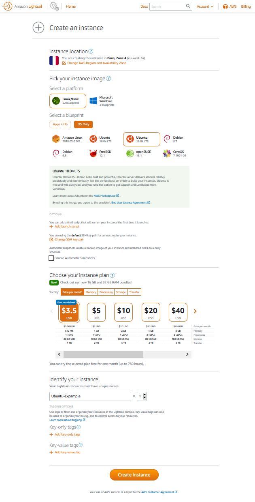

# [ <kbd>←</kbd> PlayGrounds ReadMe](https://github.com/mitmih/PlayGrounds/blob/master/readme.md) <a name="up">[](#up)</a>

# [ <kbd>↑</kbd> ](#up) <a name="h1">[Запуск сервиса Outline](#h1)</a>

В этом рецепте рассмотрим запуск собственного `shadowsocks`-сервиса [Outline](https://getoutline.org/ru/home).

Если совсем коротко, то технология `Shadowsocks` маскирует трафик под `https`.

Подробнее об отличиях между `Shadowsocks` и `VPN` можно посмотреть, например, здесь:

* [Коротко о Shadowsocks, или OpenVPN не нужен (в каждом доме)](https://habr.com/ru/post/358126/)

* [Shadowsocks или VPN — все, что вам нужно знать](https://ru.vpnmentor.com/blog/shadowsocks-или-vpn-все-что-вам-нужно-знать/)

Для семейного Outline-сервиса - пара ноутбуков и смартфонов - достаточно минимальной конфигурации виртуального сервера. Например, [Lightsail](https://lightsail.aws.amazon.com) (первый месяц предоставляют бесплатно) или любой другой облачный провайдер на ваш вкус.

Будем считать, что вы уже прошли процесс регистрации, привязали банковскую карту, для её проверки провайдер спишет $1, потом обещает вернуть :). *В течении 24 часов,* в случае успешной проверки аккаунта, откроется доступ к запуску `Lightsail`.

Приготовление Outline-сервиса сводится к нескольким простым шагам:

1. Установка [менеджера серверов Outline](https://raw.githubusercontent.com/Jigsaw-Code/outline-releases/master/manager/stable/Outline-Manager.exe)

1. Запуск нового vps-сервера, установка Ouline-сервера, настройка firewall/брандмауэра

1. Подключение Outline-клиентов


## [ <kbd>↑</kbd> ](#up) <a name="step1">[Шаг 1 - Ouline-manager](#step1)</a>

[Скачиваем](https://raw.githubusercontent.com/Jigsaw-Code/outline-releases/master/manager/stable/Outline-Manager.exe) и устанавливаем менеджер серверов Outline.

<details>
<summary> Ouline-manager, скриншот. </summary>


</details>


## [ <kbd>↑</kbd> ](#up) <a name="step2">[Шаг 2 - Outline-сервер](#step2)</a>

<details>
<summary> Запуск нового экземпляра Lightsail-сервера, скриншот. </summary>


</details>

С течением времени выданный `Public IP`-адрес может измениться, например, после перезагрузки сервера. Чтобы этого не произошло и клиенты всегда могли подключиться, нужно привязать статический IP-адрес: `Networking`, `Create Static IP`.

<details>
<summary> Подключаемся по `ssh` к серверу, скриншот. </summary>


</details>

Рекомендуется обновить списки источников пакетов и сами пакеты:

```console
ubuntu@ip-172-26-13-197:~$ sudo apt update && sudo apt upgrade -y
```

Также [рекомендуется настроить](https://www.digitalocean.com/community/tutorials/how-to-add-swap-space-on-ubuntu-18-04) файл подкачки.

<details>
<summary>Outline-сервер представляет собой `Docker`-контейнер, нужно установить `Docker`:

```console
ubuntu@ip-172-26-13-197:~$ sudo bash -c "$(wget -qO- https://get.docker.com/)"
```
</summary>

```console
# Executing docker install script, commit: 26ff363bcf3b3f5a00498ac43694bf1c7d9ce16c
+ sh -c 'apt-get update -qq >/dev/null'
+ sh -c 'DEBIAN_FRONTEND=noninteractive apt-get install -y -qq apt-transport-https ca-certificates curl >/dev/null'
+ sh -c 'curl -fsSL "https://download.docker.com/linux/ubuntu/gpg" | apt-key add -qq - >/dev/null'
Warning: apt-key output should not be parsed (stdout is not a terminal)
+ sh -c 'echo "deb [arch=amd64] https://download.docker.com/linux/ubuntu bionic stable" > /etc/apt/sources.list.d/docker.list'
+ sh -c 'apt-get update -qq >/dev/null'
+ '[' -n '' ']'
+ sh -c 'apt-get install -y -qq --no-install-recommends docker-ce >/dev/null'
+ sh -c 'docker version'
Client: Docker Engine - Community
 Version:           19.03.8
 API version:       1.40
 Go version:        go1.12.17
 Git commit:        afacb8b7f0
 Built:             Wed Mar 11 01:25:46 2020
 OS/Arch:           linux/amd64
 Experimental:      false

Server: Docker Engine - Community
 Engine:
  Version:          19.03.8
  API version:      1.40 (minimum version 1.12)
  Go version:       go1.12.17
  Git commit:       afacb8b7f0
  Built:            Wed Mar 11 01:24:19 2020
  OS/Arch:          linux/amd64
  Experimental:     false
 containerd:
  Version:          1.2.13
  GitCommit:        7ad184331fa3e55e52b890ea95e65ba581ae3429
 runc:
  Version:          1.0.0-rc10
  GitCommit:        dc9208a3303feef5b3839f4323d9beb36df0a9dd
 docker-init:
  Version:          0.18.0
  GitCommit:        fec3683
If you would like to use Docker as a non-root user, you should now consider
adding your user to the "docker" group with something like:

  sudo usermod -aG docker your-user

Remember that you will have to log out and back in for this to take effect!

WARNING: Adding a user to the "docker" group will grant the ability to run
         containers which can be used to obtain root privileges on the
         docker host.
         Refer to https://docs.docker.com/engine/security/security/#docker-daemon-attack-surface
         for more information.
```

</details>

И добавить пользователя `ubuntu` в группу `docker`:

```console
ubuntu@ip-172-26-13-197:~$ sudo usermod -aG docker ubuntu
```

<details>
<summary>Для установки `Docker`-контейнера Outline-сервера копируем из пункта (1) менеджера Ouline и вставляем <kbd>shift</kbd> <kbd>Ins</kbd> в ssh-консоль команду установки:

```console
ubuntu@ip-172-26-13-197:~$ sudo bash -c "$(wget -qO- https://raw.githubusercontent.com/Jigsaw-Code/outline-server/master/src/server_manager/install_scripts/install_server.sh)"
```
</summary>

```console
ubuntu@ip-172-26-13-197:~$ sudo bash -c "$(wget -qO- https://raw.githubusercontent.com/Jigsaw-Code/outline-server/master/src/server_manager/install_scripts/install_server.sh)"
> Verifying that Docker is installed .......... OK
> Verifying that Docker daemon is running ..... OK
> Creating persistent state dir ............... OK
> Generating secret key ....................... OK
> Generating TLS certificate .................. OK
> Generating SHA-256 certificate fingerprint .. OK
> Writing config .............................. OK
> Starting Shadowbox .......................... OK
> Starting Watchtower ......................... OK
> Waiting for Outline server to be healthy .... OK
> Creating first user ......................... OK
> Adding API URL to config .................... OK
> Checking host firewall ...................... BLOCKED
OK

CONGRATULATIONS! Your Outline server is up and running.

To manage your Outline server, please copy the following line (including curly
brackets) into Step 2 of the Outline Manager interface:

{"apiUrl":"https://15.236.142.214:39415/E20HL-jc_Qm41bgO7ci4mQ","certSha256":"BC023480E79EA4730D0FE8B62C10EBD51966183B727F7FEEC2C148A5DB87060A"}

You won’t be able to access it externally, despite your server being correctly
set up, because there's a firewall (in this machine, your router or cloud
provider) that is preventing incoming connections to ports 39415 and 58398.

Make sure to open the following ports on your firewall, router or cloud provider:
- Management port 39415, for TCP
- Access key port 58398, for TCP and UDP

```

</details>

<details><summary> Необходимые порты пока закрыты. Переходим на вкладку "Networking" и  добавляем - "+ Add rule" - три новых правила для указанных в консоли портов.
</summary>


</details>

<details><summary>Затем, выделяем в консоли, копируем <kbd>ctrl</kbd> <kbd>Ins</kbd> и вставляем обратно в Ouline-менеджер, пункт (2), строку для подключения менеджера к серверу. Нажимаем "Готово".
</summary>


</details>

> P.S. строка подключения менеджера к серверу формируется из файла `/opt/outline/access.txt`, так что её всегда можно восстановить вручную
<details><summary></summary>

> ```console
> ubuntu@ip-172-26-13-197:~$ sudo cat /opt/outline/access.txt
> certSha256:BC023480E79EA4730D0FE8B62C10EBD51966183B727F7FEEC2C148A5DB87060A
> apiUrl:https://15.236.142.214:39415/E20HL-jc_Qm41bgO7ci4mQ
> ```
details
</details>


## [ <kbd>↑</kbd> ](#up) <a name="step3">[Шаг 3 - Ouline-клиенты](#step3)</a>

Если менеджер успешно подключился к серверу, то можно подключать клиентов. По умолчанию, на сервере определён один клиентский ключ `Мой ключ доступа`. Можно использовать его или добавить новых клиентов.

В любом случае, для подключения нового клиента, нужно скопировать из менеджера его ключ и передать безопасным способом.

<details><summary>Ouline-manager: нажимаем на значок для копирования, выбираем "Подключить другое устройство".
</summary>


</details>

<details><summary>Ouline-manager: копируем ключ в буфер обмена
</summary>


</details>

<details><summary>Ouline-клиент: при открытии и наличии скопированного ключа автоматически предлагает добавить новый сервер
</summary>


</details>

<!--

<details><summary>
</summary>
</details>


## [ <kbd>↑</kbd> ](#up) <a name="step1">[Шаг 1 - Устанавливаем WireGuard, разбираемся с серверными ключами шифрования](#step1)</a>

-->
